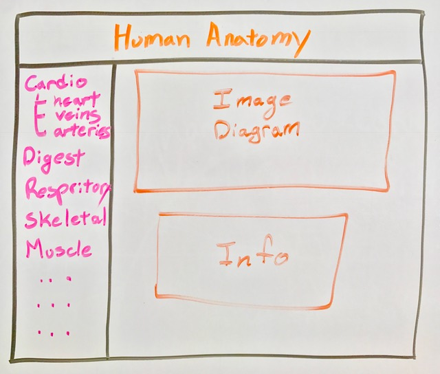
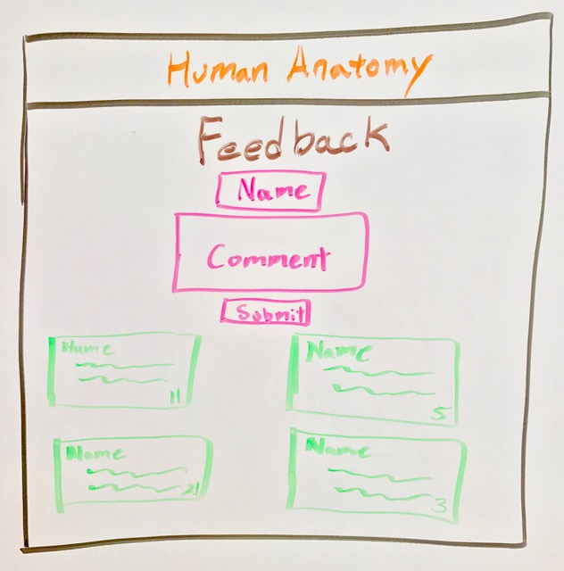
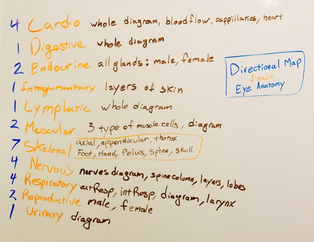

# Human Anatomy Site (Project 4)
 
General review site on the human anatomy and its systems with location of each organ and flow of movement. Filtered views of the body to focus each area and even overlap systems to see there placements. A dedicated feedback page to give recommendations on how I can improve the site to the current medical standards.
 
### User Stories
 
As a user, there should be easy to read buttons, along with quick settings adjusting what to display and how.
Clear indication of parts along with names. Finally, an option to submit comments and see them.
 
### Wireframes

Home Page 

  
Feedback Page 

  
Body Systems API 

 

### Pseudo code

* Create a database with a table to hold all the comments.
* Generate directories for views, routes and pg-promise
* UI build of HTML and CSS on landing page with a Nav bar and a main section.
* Manage functions for CR (Create and Read).
* Create second Nav bar to filter through each system to display.
* Branch off each system with sub-categories.
* Create function to display most liked comments up top.
 
### Download & Install

1. Git clone or [download](https://github.com/ericVargas/Project4) this project
2. On your terminal, run psql -f ./models/apComments.sql
3. After that run npm run dev, app should be available on localhost:3000

